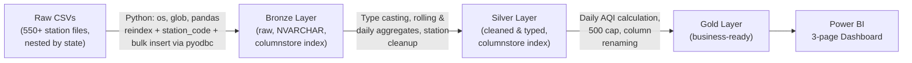
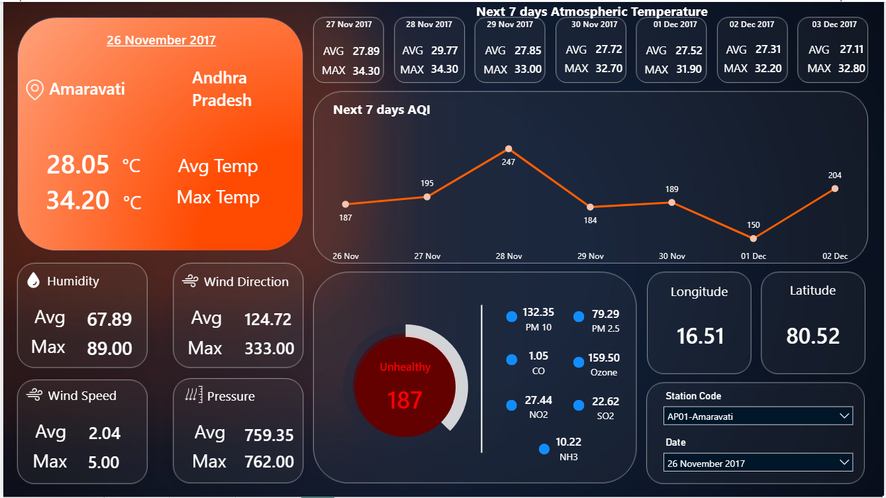
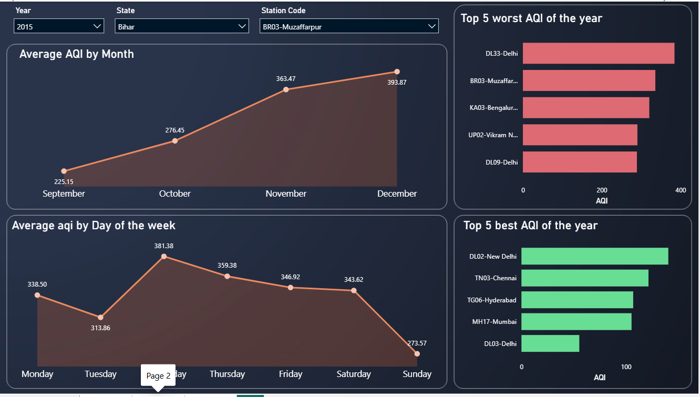
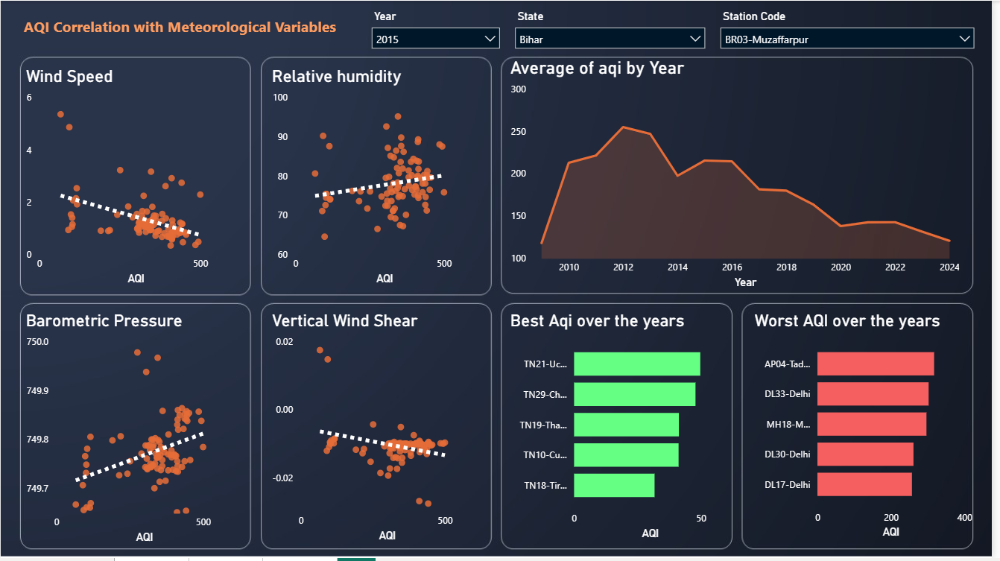

# National AQI Analytics & Engineering Pipeline

> An end-to-end SQL Server data warehouse, Python ETL pipeline, and Power BI decision-support dashboard built on 550+ air-quality monitoring stations across India (2009–2024).


---

## Overview

Public air-quality datasets are usually distributed as thousands of loosely structured, inconsistent CSV files — one per monitoring station — with no computed Air Quality Index and no standard schema. This project turns that raw data into a governed, decision-ready warehouse and dashboard:

- Ingests **15-minute pollutant readings** from **550+ CPCB monitoring stations** across India, spanning **2009–2024** (~83M+ raw records).
- Structures the data through a **3-layer Medallion architecture** (Bronze → Silver → Gold) in MS SQL Server.
- Computes a standardized **daily AQI per station** from individual pollutant concentrations.
- Surfaces the results in a **3-page Power BI dashboard** covering forecasting, seasonal/weekly trends, and meteorological correlation.

## Key Highlights

| Metric | Value |
|---|---|
| Monitoring stations | 550+ across India |
| Time range | 2009 – 2024 (15-min granularity) |
| Raw records ingested | ~83 million+ |
| Query performance gain (columnstore index) | 50–60% faster |
| Storage footprint reduction (columnstore index) | 90–95% smaller |
| Dashboard | 3-page interactive Power BI report |

## Architecture



**Layer responsibilities:**

| Layer | Responsibility | Key Transformations |
|---|---|---|
| **Bronze** | Raw ingestion | Ingests standardized CSVs as-is (NVARCHAR); columnstore index applied for fast bulk insertion and efficient raw storage. |
| **Silver** | Cleaned & typed | Casts columns to correct data types; computes rolling averages (8-hour for ozone, 1-hour for CO); computes daily averages and daily max concentrations for other pollutants; removes records for unknown/unmapped stations; columnstore index applied. |
| **Gold** | Business-ready | Calculates daily AQI per station from pollutant sub-indices; caps AQI at the standard maximum of 500; renames columns to clear, business-friendly labels. |

## Dataset

**Source:** [Kaggle](https://www.kaggle.com/) — CPCB (Central Pollution Control Board) monitoring network, covering 550+ stations across Indian states.

Each station's data arrived as a separate CSV nested inside state-level sub-folders. Column sets were **not standardized** — a station file could contain any subset of the fields below, but never fields outside this set:

```
pm2.5, pm10, no, no2, so2, co, nox, ozone, at, rh, ws, vws, wd,
bp, timestamp, nh3, benzene, eth_benzene, toluene, mp_xylene, xylene
```

Reconciling this inconsistency — before any analysis could begin — was the core data-engineering challenge this pipeline solves.

## ETL Pipeline

Built in Python, connecting to MS SQL Server via `pyodbc`.

1. **Discovery** — walk the main directory and every state sub-folder using `os` and `glob`, collecting the file path of every station CSV (excluding `stations.csv`) into a processing list.
2. **Standardization** — reindex each file against the full 20-column schema with `pandas` so every table has a uniform structure; fill missing values as `NaN`; append a `station_code` column so every row is traceable to its source station.
3. **Type strategy** — load all columns as `NVARCHAR` at ingestion time; correctness of type is deferred to the Silver layer, keeping the load step fast and resilient to malformed source data.
4. **Load** — combine all standardized files and load them via a **bulk insert** into a single consolidated Bronze table, avoiding row-by-row insert overhead.

```python
# Illustrative structure of the ingestion step — replace with your actual script
import os, glob, pandas as pd, pyodbc

conn = pyodbc.connect("DRIVER={ODBC Driver 17 for SQL Server};...")

csv_paths = [
    f for f in glob.glob(os.path.join(root_dir, "**", "*.csv"), recursive=True)
    if os.path.basename(f).lower() != "stations.csv"
]

for path in csv_paths:
    station_code = ...  # derived from folder/file naming convention
    df = pd.read_csv(path)
    df = df.reindex(columns=FULL_SCHEMA)          # enforce uniform 20-column schema
    df["station_code"] = station_code
    df = df.astype(str).where(pd.notnull(df), "NaN")
    bulk_insert(conn, df, target_table="bronze.data")
```

**Libraries used:** `pyodbc`, `os`, `glob`, `pandas`

## Database Design

| Table | Grain | Description |
|---|---|---|
| `data` (readings) | 1 row per station per 15-min interval | Core fact table holding every pollutant and meteorological reading, 2009–2024. |
| `stations` | 1 row per station | Dimension table with geographic metadata (state, location, coordinates) per station. |

### Performance: Columnstore Indexing

Analytical queries here are read-heavy and column-scoped (e.g., aggregating `pm2.5` across millions of rows) rather than single-row lookups — exactly the access pattern columnstore compression is built for. A columnstore index was applied to the Bronze and Silver readings tables.

| Metric | Impact |
|---|---|
| Query execution time | **50–60% faster** |
| Storage footprint | **Reduced by up to 90–95%** |

## Power BI Dashboard

A 3-page interactive dashboard built on the Gold layer, covering three distinct analytical needs.

### Page 1 — Station Snapshot & 7-Day AQI Forecast
Station-level operational view: current AQI status with severity classification, live pollutant breakdown (PM10, PM2.5, CO, Ozone, NO2, SO2, NH3), meteorological context, and a 7-day forward AQI/temperature outlook — filterable by station and date.



### Page 2 — Seasonal & Weekly Trend Analysis
AQI aggregated by month and day of week, alongside top 5 best/worst-performing stations for the selected year.



### Page 3 — Meteorological Correlation Analysis
AQI tested against key meteorological variables (wind speed, humidity, barometric pressure, vertical wind shear) with trend lines, plus a multi-year AQI trend and historical station rankings.



## Key Insights

- **Seasonal spike:** AQI rises sharply through Q4, climbing from ~225 in September to ~394 by December in high-pollution hubs such as Bihar and Delhi — consistent with winter temperature inversion, seasonal weather patterns, and agricultural (stubble) burning.
- **Weekly pattern:** AQI peaks mid-week (~381 on Tuesday) and drops on weekends (~273 on Sunday), pointing to commercial vehicular and industrial activity as a significant contributor.
- **Wind speed:** shows a clear negative correlation with AQI — higher wind speeds disperse particulate concentration and rapidly improve air quality.
- **Barometric pressure:** shows a positive correlation with AQI, consistent with high-pressure systems trapping pollutants closer to the surface (temperature inversion).
- **Hotspots:** Stations in Bihar (BR03-Muzaffarpur), Delhi (DL33, DL09, DL30), and Andhra Pradesh consistently register the worst annual AQI, while coastal and southern stations (e.g., Chennai, Hyderabad, Mumbai) maintain a significantly lower baseline year over year.

## Repository Structure

```
├── README.md
├── assets/                      # Dashboard screenshots used in this README
│   ├── dashboard-1-forecast.png
│   ├── dashboard-2-seasonal-trends.png
│   └── dashboard-3-meteorological-correlation.png
├── etl/                         # Python ingestion scripts (pyodbc bulk load)
├── sql/
│   ├── bronze/                  # Raw ingestion DDL + columnstore index
│   ├── silver/                  # Type casting, rolling/daily aggregates
│   └── gold/                    # Daily AQI calculation, AQI capping, renaming
└── powerbi/                     # .pbix dashboard file
```
> Adjust folder names above to match your actual repo layout.

## Getting Started

**Prerequisites**
- MS SQL Server (2019+ recommended for columnstore support)
- Python 3.9+ with `pyodbc`, `pandas`
- Power BI Desktop (to open the `.pbix` dashboard)

**Setup**
```bash
git clone https://github.com/Summer-pixel12/<repo-name>.git
cd <repo-name>
pip install -r requirements.txt
```

1. Update the connection string in `etl/` with your SQL Server instance details.
2. Run the ingestion script to populate the Bronze layer.
3. Run the SQL scripts in `sql/silver/` and `sql/gold/` in order to build out the warehouse.
4. Open `powerbi/dashboard.pbix` and point it at your Gold layer to refresh the dashboard.

## Future Scope

- Automate the Bronze → Silver → Gold refresh as a scheduled pipeline.
- Add a predictive model for AQI forecasting (the current forecast view is trend-based) using historical + meteorological features.
- Expand correlation analysis to include additional pollutant precursors such as traffic density or industrial activity indices where available.

## Author

**Harsh Sharma**
B.Tech, Civil Engineering — VNIT Nagpur
[LinkedIn](https://linkedin.com/in/harsh-sharma-347258366) · [GitHub](https://github.com/Summer-pixel12)
